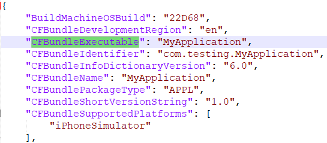
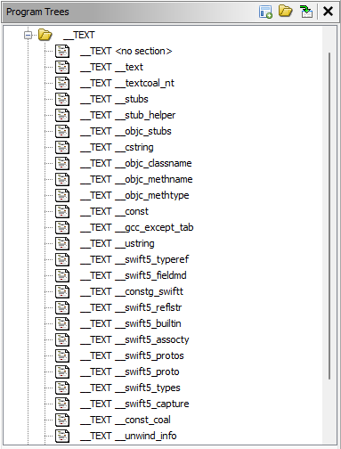

# Repository Overview
This repository is a reference for getting started with iOS Reverse Engineering! It contains all the information you need to start taking apart IPA files including:
- Scripts for helping your iOS Reverse Engineering in Ghidra
- Example iOS IPA files demonstrating different forms of obfuscation
- A guide for getting started Reverse Engineering an IPA file

I will continue to add information to this repository further iOS Reverse Engineering!

# Example IPA Files
Each IPA file is created to help you with your static analysis. Use the section below to learn how to extract the executable components and learn their inner workings.

- [Swizzling IPA](https://github.com/LaurieWired/iOS_Reverse_Engingeering/blob/main/ObfuscatedAppExamples/ObjectiveSwizzling.ipa) - This file contains an example iOS application written in Objective-C that demostrates swizzling to replace one method's implementation with another.
- [No Tampering IPA](https://github.com/LaurieWired/iOS_Reverse_Engingeering/blob/main/ObfuscatedAppExamples/NoTampering.ipa) - This file contains an example iOS application written in Swift that uses the [IOSSecuritySuite](https://github.com/securing/IOSSecuritySuite) to avoid printing the true value to the screen if it discovers any potential tampering, debugging, or emulator use.
- [Control Flow Flattening IPA](https://github.com/LaurieWired/iOS_Reverse_Engingeering/blob/main/ObfuscatedAppExamples/ControlFlowFlattening.ipa) - This file contains an example iOS application written in Swift that implements the same method without control flow flattening, with flattening, and with a more complex flattening example.

# Ghidra Scripts
This repo contains scripts for helping your iOS Reverse Engineering including:
- [Swift Name Demangler](https://github.com/LaurieWired/iOS_Reverse_Engingeering/blob/main/SwiftNameDemangler.py) - This traverses your Swift binary and demangles methods and labels. It sets each of the new names and leaves a comment with the original and demangled name above the method and label.
  - NOTE: This requires that your machine has Swift installed. See [below](https://github.com/LaurieWired/iOS_Reverse_Engingeering/edit/main/README.md#installing-swift) for help on installing Swift.
- [Swizzling Detector](https://github.com/LaurieWired/iOS_Reverse_Engingeering/blob/main/SwizzlingDetector.py) - This script searches your Objective-C binary to detect references to potential Swizzling calls. It prints the function name and all potential references in the code.

## Running the Scripts
In order to run the scripts in this repo, you can add them as new scripts for Ghidra. Either manually place them in the `ghidra_scripts` folder or add them through the Ghidra GUI. Here are the steps for both options:

### Option 1: Pasting the Script into `ghidra_scripts` Folder

1. **Locate the `ghidra_scripts` Folder**:
   - By default, Ghidra has a directory named `ghidra_scripts` in your user's home directory or within the Ghidra installation directory.
   
2. **Add the Scripts**:
   - Copy or paste the scripts into the `ghidra_scripts` folder.

3. **Refresh the Script Manager in Ghidra**:
   - If Ghidra is already open, refresh the Script Manager (`Window` -> `Script Manager`).
   - Click the "Refresh Script List" icon.

4. **Run the Script**:
   - The scripts should now appear in the Script Manager.
   - Highlight the script and click the green "Run" button. Make sure you have the appropriate binary opened in Ghidra.

### Option 2: Using the Ghidra GUI

1. **Open the Script Manager**:
   - Navigate to `Window` -> `Script Manager` in Ghidra.

2. **Determine Script Directory**:
   - In the Script Manager, there's an icon with three dots. Click it to see the script directories.

3. **Use the "New Script" Option**:
   - In the Script Manager, click on the "New Script" icon.
   - This will open a dialog where you can write or paste your script and save it.

4. **Run the Script**:
   - After saving, the script will appear in the Script Manager.
   - Highlight the script and click the green "Run" button. Make sure you have the appropriate program or binary opened in Ghidra.


## Installing Swift

Visit the [Swift Downloads](https://www.swift.org/download/) page to install Swift for your operating system of choice. Once you have installed it, check to see if you are able to now run the commands by attempting to demangle a symbol:

Mac:
```
xcrun swift-demangle '_$s21ControlFlowFlattening11ContentViewVACycfC'
```

Windows:
```
swift-demangle _$s21ControlFlowFlattening11ContentViewVACycfC
```

If you do not get an error, you can now run the demangler script in Ghidra.

# Getting Started Reversing iOS IPA Files
IPA (iOS App Store Package) files are special kinds of zip files that bundle the executable and resources needed for an iOS application. In order to get the components of an iOS application, simply unzip the IPA file just like a zip. You should see something similar to the following hierarchy:

```
MyApp.ipa
├──Payload/
   └── MyApp.app/
       ├── Info.plist
       ├── MyApp
       └── + Many more supporting files
```

## Finding the Application Entrypoint in code
In order to find the entrypoint of an application, check the Info.plist file. A plist (property list) file is a structured data representation used by iOS as well as other *OS systems such as Mac. It is often for storing user settings and information about bundles and applications. These can be in an XML or binary format. Reading an XML plist is as simple as throwing the file in a text editor, but reading a binary plist requires some decoding to convert to a human-readable format.

### Reading a Binary Property List
Mac has a built-in plist reader. Simply open the plist file and it will default to the human-readable format whether XML or binary. If not working on Mac, the following Python code decodes a binary plist and prints it as a JSON string to the console:

```
import plistlib
import json

with open('Info.plist', 'rb') as fp:
    pl = plistlib.load(fp)

print(json.dumps(pl, indent=4))
```

### Finding the Executable in the Info.plist
Once, you have opened the plist text, the main executable will be found under the "CFBundleExecutable" tag.



This string will name a Mach-O binary inside of the application bundle that will be the main entrypoint of the application.


After locating this Mach-O binary, you can import this file into Ghidra and begin your analysis of the code. Mach-O files can be FAT binaries, meaning that they may contain bundle support for more than one architecture. If this is the case, you can select the ```Batch``` option when importing the binary into Ghidra and select the architectures you would like to import. For an accompanying example of this process, see [YouTube - Finding the Entrypoint of iOS Apps in Ghidra](https://www.youtube.com/watch?v=mLDsIMXafP4).

## Finding Strings
The Mach-O binary contains many strings used inside of the code. Select `Search` -> `For Strings...` inside of Ghidra to begin looking at the data. Additionally, the ```.lproj``` directories contain localized strings used by the application. Each directory contains strings for separate locales translated to different languages. For example, if you're searching for the strings in English, maneuver to the ```en.lproj``` directory and open the ```Localizable.strings``` file. This file is encoded, but corresponds to key-value pairs and is easily decoded with plutil:

### Decoding Via plutil
Mac:
```
plutil -p Payload/MyApp.app/en.lproj/Localizable.strings
```

## Locating Application Permissions

### Entitlements

The app entitlements can be found inside the ```Payload/MyApp.app/embedded.mobileprovision``` file. These give the executable the rights to perform certain capabilities. For example, this may specify whether the app wants the permission to access iCloud or the Keychain. The entitlements can be found under the <key>Entitlements</key> section.

### Info.plist
The ```Info.plist``` also may contain additional permissions for the application. For example, if the application wants to access the camera or user data, you may find ```NSCameraUsageDescription``` or ```NSContactsUsageDescription``` specifying a reason why the app needs this permission. This message is displayed to the user when the app requests the permission.

## Reverse Engineering iOS Code

### iOS Programming Languages

Most newer iOS binaries will be written in Swift, but many legacy applications will still be written in Objective-C. Swift is designed to be interoperable with Objective-C. This means that Swift code can call Objective-C code and vice-versa. There may also be many references to the Objective-C runtime or libraries inside of Swift binaries, so it is important to be able to understand both. 

To determine if a binary is written in Swift, check the Mach-O sections and see if there is a ```__swift5_``` section in the TEXT segment. This indicates the presence of Swift code. The Program Tree in Ghidra can be used to view the segments and sections of the binary.



### Reversing Objective-C Code
Objective-C uses dynamic method resolution for method invocations. Methods are specified by Selectors and then dynamically resolved at runtime via message passing. Decompilation in Ghidra displays the Objective-C runtime methods that perform this selction. For example, ```_objc_msgSend``` is part of the Objective-C runtime. References to all runtime methods can be found in the [Objective-C Runtime Reference](https://developer.apple.com/documentation/objectivec).

Insert ghidra screenshot

For additional details on following Objective-C code in Ghidra, see [YouTube - Objective-C Calling Conventions](https://www.youtube.com/watch?v=eI-Btfjp-fg).

### Name Mangling
Fixing swift mangled names

Mac:
```
xcrun swift-demangle '_$s21ControlFlowFlattening11ContentViewVACycfC'
```

Windows:
```
swift-demangle _$s21ControlFlowFlattening11ContentViewVACycfC
```

Running the script

### Common Entrypoints for Swift and Objective C Code

The following contains a table of common methods to look at when starting to Reverse Engineer and iOS application. These are different entrypoints of code that may be executed for different states of the application.

| Class              | Method (Objective-C / Swift)  | Description |
|--------------------|-------------------------------|-------------|
| `UIApplicationDelegate` | `application:didFinishLaunchingWithOptions:` / `application(_:didFinishLaunchingWithOptions:)` | Called when the application has finished launching, but before it has started running. Often used for set-up code that doesn't involve the UI. |
| `UIApplicationDelegate` | `applicationDidBecomeActive:` / `applicationDidBecomeActive(_:)` | Called when the application has become active and can start running code. |
| `SceneDelegate` | `scene:willConnectToSession:options:` / `scene(_:willConnectToSession:options:)` | Called when a new scene is being created. |
| `SceneDelegate` | `sceneDidBecomeActive:` / `sceneDidBecomeActive(_:)` | Called when the scene becomes active (the app is in the foreground and receiving events). |
| `UIViewController` | `viewDidLoad` / `viewDidLoad()` | Called after the controller's view is loaded into memory. Ideal for initial setup. |
| `UIViewController` | `viewWillAppear:` / `viewWillAppear(_:)` | Called before the view is added to the app's view hierarchy. |


